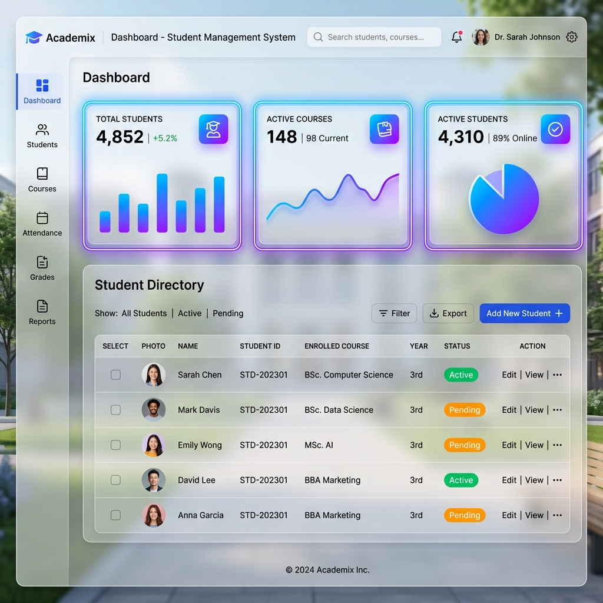
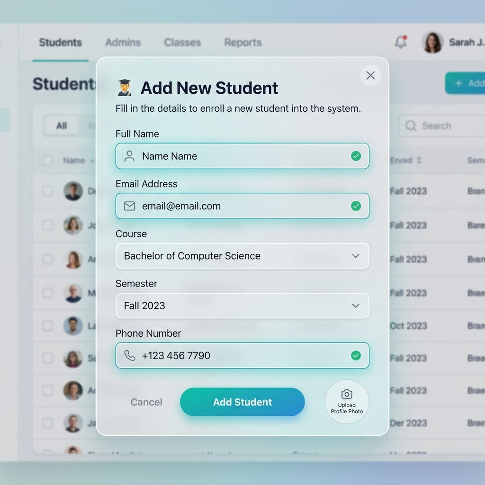
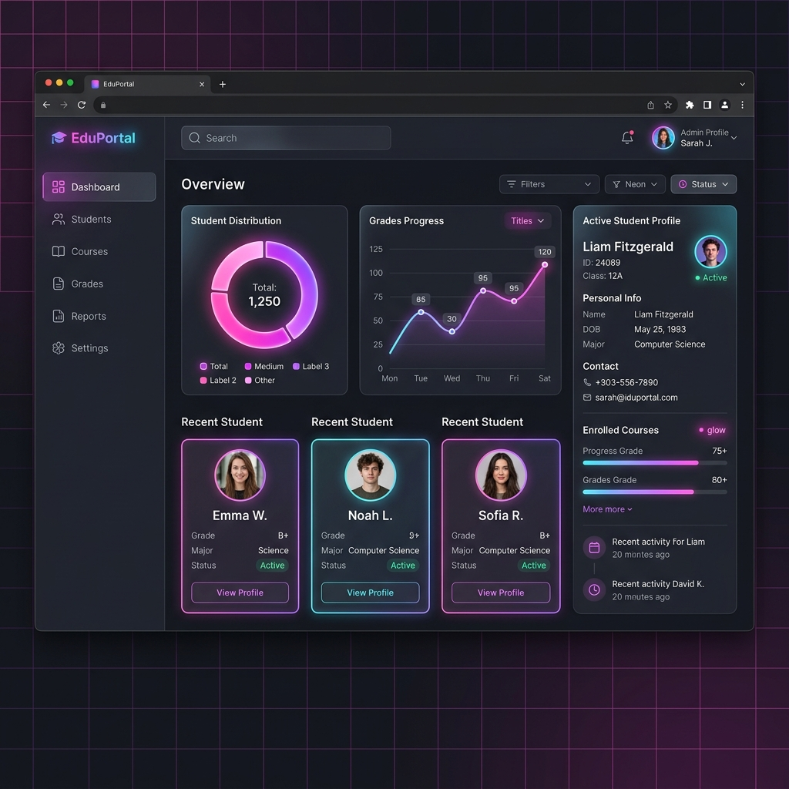

# Student Management System

A professional, fully-featured, full-stack Student Management System designed to handle student academic records. The application combines a sleek, modern glassmorphism web dashboard with a secure, production-ready Node.js RESTful API and a MongoDB Atlas database.

This project is tailored for portfolio showcases and internship submissions, demonstrating high-quality coding standards in both frontend and backend development.

---

## 🔧 Technical Stack

### Frontend
- **HTML5**: Semantic document structure and accessibility guidelines (ARIA).
- **CSS3**: Custom custom properties, grid layouts, flexbox, glassmorphism design language, and keyframe animations.
- **JavaScript (ES6+)**: Dynamic DOM manipulation, state management, form validation, and asynchronous API calls.

### Backend
- **Node.js**: Asynchronous event-driven JavaScript runtime environment.
- **Express.js**: Lightweight framework for building RESTful routing architectures and middlewares.

### Database
- **MongoDB Atlas**: Fully-managed cloud NoSQL database service.
- **Mongoose**: Elegant Object Data Modeling (ODM) library for schema definition and validation.

---

## ✨ Features

- **CRUD Operations**: Add, view, edit, and delete student records with immediate database persistence.
- **Real-time Search**: Instant keystroke search across student names, IDs, courses, emails, and phone numbers.
- **Statistics Dashboard**: Interactive widgets summarizing total students, unique courses, highest semester, and the latest added student.
- **Data Validation**: Real-time frontend inline feedback coupled with strict backend Mongoose schema validation.
- **Dark Mode**: High-contrast, vibrant neon-accented dark mode with automatic browser state persistence.
- **CSV Import / Export**: Download entire directories as formatted CSV or import bulk rosters securely with automatic duplicate skipping.
- **Responsive UI**: Fully mobile-responsive layout optimizing readability on desktops, tablets, and smartphones.

---

## 📸 Screenshots

### 🖥️ Dashboard Overview

*Modern glassmorphism statistics widgets and live interactive student data tables.*

### ➕ Add Student Modal Form

*Inline client-side validation, neat input fields, and intuitive submit controls.*

### 🌙 Dark Theme Interface

*Aesthetically pleasing high-end dark mode styled with neon glowing accents.*

---

## 📡 API Reference

All requests and responses use standard JSON format. The backend RESTful API listens at: `http://localhost:5000/api/students`

| Method | Endpoint | Description | Request Body |
| :--- | :--- | :--- | :--- |
| **GET** | `/api/students` | Retrieve all student records, newest first | None |
| **POST** | `/api/students` | Register a new student record | Student Object |
| **PUT** | `/api/students/:id` | Update an existing student record (mutates specific fields) | Updatable fields |
| **DELETE** | `/api/students/:id` | Permanently delete a student record by DB ID | None |
| **GET** | `/api/students/search` | Search students using a query parameter (`?q=val`) | None |
| **GET** | `/api/students/stats` | Retrieve aggregated dashboard counts and stats | None |

### Student Object Schema
```json
{
  "studentId": "STU001",
  "name": "Aashika Jain",
  "email": "aashika@gmail.com",
  "course": "B.Tech CSE",
  "semester": 5,
  "phone": "9876543210"
}
```

---

## 📁 Folder Structure

```text
student-management-system/
│
├── screenshots/          ← System visual mockups
│   ├── dashboard.png
│   ├── add-student.png
│   └── dark-mode.png
│
├── backend/              ← Node.js & Express REST API
│   ├── config/           ← Database configuration (Mongoose)
│   ├── controllers/      ← Request handler logic
│   ├── middleware/       ← Global error and 404 middleware
│   ├── models/           ← Database schemas (Mongoose)
│   ├── routes/           ← HTTP API routing definitions
│   ├── .env              ← Environment variables
│   ├── server.js         ← Backend server entry point
│   └── package.json      ← Backend dependencies
│
├── index.html            ← Frontend HTML5 document structure
├── style.css             ← Frontend UI styling rules
├── script.js             ← Frontend application logic
├── .gitignore            ← Project repository ignore rules
└── README.md             ← Main documentation file
```

---

## 🚀 Deployment Instructions

### Prerequisites
Make sure you have [Node.js](https://nodejs.org/) installed (v16+ recommended) and a running [MongoDB Atlas](https://www.mongodb.com/cloud/atlas) cluster.

### 1. Database Connection String Setup
Navigate to the `backend/` folder, open/create the `.env` configuration file, and add your MongoDB Atlas credentials:
```env
PORT=5000
MONGO_URI=mongodb+srv://<username>:<password>@<cluster>.mongodb.net/sms_db?retryWrites=true&w=majority
```

### 2. Start the Backend Server
Run the following commands in your terminal:
```bash
cd backend
npm install
npm run dev
```
*The server will start running on port `5000` and will log a success message upon establishing connection to MongoDB.*

### 3. Open the Frontend Application
Simply open `index.html` in any web browser of your choice. The frontend is configured to communicate with the local backend endpoint at `http://localhost:5000/api/students`.

---

## 🔍 Frontend Form Validation Rules

| Field | Rules |
| :--- | :--- |
| **Student ID** | Required · Unique · Letters & numbers only · 3–15 characters |
| **Full Name** | Required · 3–50 characters · Alphabetic characters only |
| **Email** | Required · Valid email address formatting |
| **Course** | Required · Minimum 2 characters |
| **Semester** | Required · Numeric value between 1 and 8 |
| **Phone** | Required · Exactly 10 numeric digits |

---

## 🧑‍💻 JavaScript Functions Reference (Frontend)

| Function | Purpose |
| :--- | :--- |
| `loadStudents()` | Asynchronously fetches student data from the backend database (falls back to LocalStorage if offline) |
| `addStudent()` | Posts a new student record to the Node/Express backend |
| `updateStudent()` | Sends a `PUT` update request to the database for editing student records |
| `deleteStudent(id)` | Triggers deletion confirmation modals prior to making backend `DELETE` API requests |
| `validateForm()` | Runs dynamic client-side field validation before submitting forms |
| `exportCSV()` | Compiles active grid contents and downloads UTF-8 formatted spreadsheets |
| `toggleDarkMode()` | Toggles high-end visual styles and saves state preferences in `LocalStorage` |

---

## 🧑‍💻 Author

**Aashika Jain**

- GitHub: [aashi1310](https://github.com/aashi1310)
- Project: Full-Stack Student Management System — Internship Submission Portfolio

---

## 📄 License

This project is open-source and available under the [MIT License](LICENSE).
